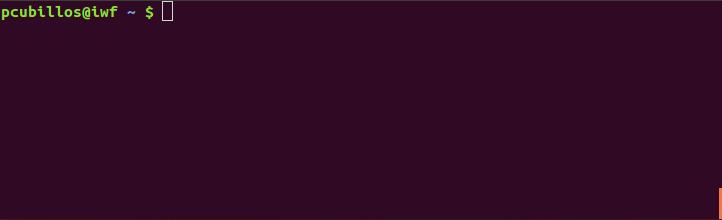

.. _bibtex:

BibTeX Management
=================

.. _reset:

reset
-----

Reset the bibmanager database.

**Usage**

.. code-block:: shell

  bibm reset [-h] [-d | -c] [bibfile]

This command resets the bibmanager database from scratch.
It creates a .bibmanager/ folder in the user folder (if it does not
exists already), and it resets the bibmanager configuration to
its default values.

If the user provides the ``bibfile`` argument, this command will
populate the database with the entries from that file; otherwise,
it will set an empty database.

Note that this will overwrite any pre-existing database.  In
principle the user should not execute this command more than once
in a given CPU.

**Options**

| **bibfile**
|          Path to an existing BibTeX file.
|
| **-d, -\\-database**
|          Reset only the bibmanager database.
|
| **-c, -\\-config**
|          Reset only the bibmanager config parameters.
|
| **-h, -\\-help**
|          Show this help message and exit.

**Examples**

.. code-block:: shell

  # Reset bibmanager database from scratch:
  bibm reset

  # Reset, including entries from a BibTeX file:
  bibm reset my_file.bib

  # Reset only the database (keep config parameters):
  bibm reset my_file.bib -d

  # Reset only the config parameters (keep database):
  bibm reset -c

--------------------------------------------------------------------

.. _merge:

merge
-----

Merge a BibTeX file into the bibmanager database.

**Usage**

.. code-block:: shell

  bibm merge [-h] bibfile [take]

**Description**

This command merges the content from an input BibTeX file with the
bibmanager database.

The optional 'take' arguments defines the protocol for possible-
duplicate entries.  Either take the 'old' entry (database), take
the 'new' entry (bibfile), or 'ask' the user through the prompt
(displaying the alternatives).  bibmanager considers four fields
to check for duplicates: doi, isbn, bibcode, and eprint.

| Additionally, bibmanager considers two more cases (always asking):
| (1) new entry has duplicate key but different content, and
| (2) new entry has duplicate title but different key.

**Options**

| **bibfile**
|       Path to an existing BibTeX file.
|
| **take**
|       Decision protocol for duplicates (choose: {old, new, ask}, default: old)
|
| **-h, -\\-help**
|       Show this help message and exit.

**Examples**

.. code-block:: shell

  # Merge BibTeX file ignoring duplicates (unless they update from arXiv to peer-reviewed):
  bibm merge my_file.bib

  # Merge BibTeX file ovewriting entries if they are duplicates:
  bibm merge my_file.bib new

  # Merge BibTeX file asking the user which to take for each duplicate:
  bibm merge my_file.bib ask

--------------------------------------------------------------------

.. _edit:

edit
----

Edit the bibmanager database in a text editor.

**Usage**

.. code-block:: shell

  bibm edit [-h]

**Description**

This command let's you manually edit the bibmanager database,
in your pre-defined text editor.  Once finished editing, save and
close the text editor, and press ENTER in the terminal to
incorporate the edits (edits after continuing on the terminal won't
count).

bibmanager selects the OS default text editor.  But the user can
set a preferred editor, see 'bibm config -h' for more information.

**Options**

| **-h, -\\-help**
|       Show this help message and exit.

**Examples**

.. code-block:: shell

  # Launch text editor on the bibmanager BibTeX database:
  bibm edit

.. _meta:

Meta-Information
^^^^^^^^^^^^^^^^

| *(New since Version 1.2)*
| ``bibmanager`` allows the user to add meta-information
  to the entries (info that is not contained in the BibTex itself).  This
  meta-info can be set while editing the database with the ``bibm edit``
  command, by writting it before an entry.
  There are currently two meta-parameters:

- The *freeze* meta-parameter is a flag that freezes an entry, preventing
  it to be modified when running :ref:`ads-update`.

- The *pdf* meta-parameter links a PDF file to the entry.  To do this,
  type '*pdf:*' followed by the path to a PDF file.  If the PDF file is already
  in the *home/pdf* folder (see :ref:`config`), there's no need to specify
  the path to the file.  Alternatively, see the commands in :ref:`pdf`.

- The *tags* meta-parameter enable setting user-defined tags for
  grouping and searching entries *(New since Version 1.4)*

Below there's an example to freeze and link a PDF file to an entry:

.. code-block:: shell

    This file was created by bibmanager
    https://pcubillos.github.io/bibmanager/

    ...

    freeze
    pdf: /home/user/Downloads/Rubin1980.pdf
    @ARTICLE{1980ApJ...238..471R,
           author = {{Rubin}, V.~C. and {Ford}, W.~K., Jr. and {Thonnard}, N.},
            title = "{Rotational properties of 21 SC galaxies with a large range of luminosities and radii, from NGC 4605 (R=4kpc) to UGC 2885 (R=122kpc).}",
          journal = {\apj},
             year = "1980",
            month = "Jun",
           volume = {238},
            pages = {471-487},
              doi = {10.1086/158003},
           adsurl = {https://ui.adsabs.harvard.edu/abs/1980ApJ...238..471R},
          adsnote = {Provided by the SAO/NASA Astrophysics Data System}
    }

    ...

--------------------------------------------------------------------

.. _add:

add
---

Add entries into the bibmanager database.

**Usage**

.. code-block:: shell

  bibm add [-h] [take]

**Description**

This command allows the user to manually add BibTeX entries into
the bibmanager database through the terminal prompt.

The optional 'take' argument defines the protocol for
possible-duplicate entries.  Either take the 'old' entry (database), take
the 'new' entry (bibfile), or 'ask' the user through the prompt
(displaying the alternatives).  bibmanager considers four fields
to check for duplicates: doi, isbn, bibcode, and eprint.

| Additionally, bibmanager considers two more cases (always asking):
| (1) new entry has duplicate key but different content, and
| (2) new entry has duplicate title but different key.

**Options**

| **take**
|       Decision protocol for duplicates (choose: {old, new, ask}, default: new)
|
| **-h, -\\-help**
|       Show this help message and exit.

**Examples**

.. code-block:: shell

  # Start multi-line prompt session to enter one or more BibTeX entries:
  bibm add

--------------------------------------------------------------------

tag
---

Add or remove tags to entries in the database.

**Usage**

.. code-block:: shell

  bibm tag [-h] [-d] [-v VERB]

**Description**

| This command adds or removes user-defined tags to specified entries in the Bibmanager database, which can then be used for grouping and searches.  The tags are case sensitive and should not contain blank spaces.
| *(New since version 1.4)*

| Additionally, if the user only sets tags (but no entries), this
  command will display the existing entries that contain those tags.
| There are five levels of verbosity:
| verb < 0:  Display only the keys of the entries
| verb = 0:  Display the title, year, first author, and key
| verb = 1:  Display additionally the ADS/arXiv urls and meta info
| verb = 2:  Display additionally the full list of authors
| verb > 2:  Display the full BibTeX entries

**Options**

| **-h, -\\-help**
|       Show this help message and exit.
| **-d, -\\-delete**
|       Delete tags instead of add.
| **-v VERB, -\\-verb VERB**
|       Verbosity level if used to display entries.

**Examples**

.. code-block:: shell

  # Add a tag to an entry:
  bibm tag
  (Syntax is: KEY_OR_BIBCODE KEY_OR_BIBCODE2 ... tags: TAG TAG2 ...)
  Hunter2007ieeeMatplotlib tag: python

  # Add multiple tags to multiple entries:
  bibm tag
  (Syntax is: KEY_OR_BIBCODE KEY_OR_BIBCODE2 ... tags: TAG TAG2 ...)
  1913LowOB...2...56S 1918ApJ....48..154S tags: galaxies history

  # Remove tags:
  bibm tag -d
  (Syntax is: KEY_OR_BIBCODE KEY_OR_BIBCODE2 ... tags: TAG TAG2 ...)
  Slipher1913lobAndromedaRarialVelocity tags: galaxies

  # Display all entries that contain the 'galaxies' tag:
  bibm tag
  (Syntax is: KEY_OR_BIBCODE KEY_OR_BIBCODE2 ... tags: TAG TAG2 ...)
  tags: galaxies

--------------------------------------------------------------------

.. _search:

search
------

Search entries in the bibmanager database.

**Usage**

.. code-block:: shell

  bibm search [-h] [-v VERB]

**Description**

This command will trigger a prompt where the user can search
for entries in the bibmanager database by authors, years, title keywords,
BibTeX key, or ADS bibcode. The matching results are displayed on screen
according to the specified verbosity.
Search syntax is similar to ADS searches (including tab completion).

Multiple author, title keyword, and year queries act with AND logic;
whereas multiple-key queries and multiple-bibcode queries act with OR
logic (see examples below).

| There are five levels of verbosity:
| verb < 0:  Display only the keys of the entries
| verb = 0:  Display the title, year, first author, and key
| verb = 1:  Display additionally the ADS/arXiv urls and meta info
| verb = 2:  Display additionally the full list of authors
| verb > 2:  Display the full BibTeX entries

.. note::
  (1) There's no need to worry about case in author names, unless they
      conflict with the BibTeX format rules:
      http://mirror.easyname.at/ctan/info/bibtex/tamethebeast/ttb_en.pdf, p.23.
      For example, *author:"oliphant, t"* will match *'Travis Oliphant'*
      (because there is no ambiguity in first-von-last names), but
      *author:"travis oliphant"* wont match, because the lowercase *'travis'*
      will be interpreted as the von part of the last name.

  (2) Title words/phrase searches are case-insensitive.

**Options**

| **-v VERB, -\\-verb VERB**
|           Set output verbosity.
|
| **-h, -\\-help**
|           Show this help message and exit.

**Examples**

.. note::  These examples below assume that you merged the sample bibfile
  already, i.e.: ``bibm merge ~/.bibmanager/examples/sample.bib``

Searches follow the ADS search syntax.  Pressing *tab* displays the
search fields:

   The tab-completion also displays extra information at the bottom
   when navigating through some options.

Name examples:

.. code-block:: shell

  # Search by last name (press tab to prompt the autocompleter):
  bibm search
  (Press 'tab' for autocomplete)
  author:"oliphant"

  Title: Array programming with NumPy, 2020
  Authors: {Harris}, Charles R.; et al.
  key: HarrisEtal2020natNumpy

  Title: SciPy 1.0: fundamental algorithms for scientific computing in Python,
      2020
  Authors: {Virtanen}, Pauli; et al.
  key: VirtanenEtal2020natmeScipy

.. code-block:: shell

  # Search by last name and initials (note blanks require one to use quotes):
  bibm search
  (Press 'tab' for autocomplete)
  author:"oliphant, t"

  Title: Array programming with NumPy, 2020
  Authors: {Harris}, Charles R.; et al.
  key: HarrisEtal2020natNumpy

  Title: SciPy 1.0: fundamental algorithms for scientific computing in Python,
      2020
  Authors: {Virtanen}, Pauli; et al.
  key: VirtanenEtal2020natmeScipy

.. code-block:: shell

  # Search by first-author only:
  bibm search
  author:"^Harris"

  Title: Array programming with NumPy, 2020
  Authors: {Harris}, Charles R.; et al.
  key: HarrisEtal2020natNumpy

.. code-block:: shell

  # Search multiple authors (using AND logic):
  bibm search
  (Press 'tab' for autocomplete)
  author:"harris" author:"virtanen"

  Title: Array programming with NumPy, 2020
  Authors: {Harris}, Charles R.; et al.
  key: HarrisEtal2020natNumpy

  Title: SciPy 1.0: fundamental algorithms for scientific computing in Python,
      2020
  Authors: {Virtanen}, Pauli; et al.
  key: VirtanenEtal2020natmeScipy

Combine search fields:

.. code-block:: shell

  # Search by author, year, and title words/phrases (using AND logic):
  bibm search
  (Press 'tab' for autocomplete)
  author:"oliphant, t"  title:"numpy"

  Title: Array programming with NumPy, 2020
  Authors: {Harris}, Charles R.; et al.
  key: HarrisEtal2020natNumpy

.. code-block:: shell

  # Search multiple words/phrases in title (using AND logic):
  bibm search
  (Press 'tab' for autocomplete)
  title:"HD 209458b" title:"atmospheric circulation"

  Title: Atmospheric Circulation of Hot Jupiters: Coupled Radiative-Dynamical
         General Circulation Model Simulations of HD 189733b and HD 209458b,
         2009
  Authors: {Showman}, Adam P.; et al.
  key: ShowmanEtal2009apjRadGCM

Year examples:

.. code-block:: shell

  # Search on specific year:
  bibm search
  (Press 'tab' for autocomplete)
  year: 1913

  Title: The radial velocity of the Andromeda Nebula, 1913
  Authors: {Slipher}, V. M.
  key: Slipher1913lobAndromedaRarialVelocity

.. code-block:: shell

  # Search anything between the specified years (inclusive):
  bibm search
  (Press 'tab' for autocomplete)
  year:2013-2016

  Title: Novae in the Spiral Nebulae and the Island Universe Theory, 1917
  Authors: {Curtis}, H. D.
  key: Curtis1917paspIslandUniverseTheory

  Title: The radial velocity of the Andromeda Nebula, 1913
  Authors: {Slipher}, V. M.
  key: Slipher1913lobAndromedaRarialVelocity

.. code-block:: shell

  # Search anything up to the specified year (note this syntax is not available on ADS):
  bibm search
  (Press 'tab' for autocomplete)
  year: -1917

  Title: Novae in the Spiral Nebulae and the Island Universe Theory, 1917
  Authors: {Curtis}, H. D.
  key: Curtis1917paspIslandUniverseTheory

  Title: The radial velocity of the Andromeda Nebula, 1913
  Authors: {Slipher}, V. M.
  key: Slipher1913lobAndromedaRarialVelocity

.. code-block:: shell

  # Search anything since the specified year:
  bibm search
  (Press 'tab' for autocomplete)
  author:"oliphant, t" year: 2020-

  Title: Array programming with NumPy, 2020
  Authors: {Harris}, Charles R.; et al.
  key: HarrisEtal2020natNumpy

  Title: SciPy 1.0: fundamental algorithms for scientific computing in Python,
      2020
  Authors: {Virtanen}, Pauli; et al.
  key: VirtanenEtal2020natmeScipy

ADS bibcode examples (same applies to searches by key):

.. code-block:: shell

  # Search by bibcode:
  bibm search
  (Press 'tab' for autocomplete)
  bibcode:2013A&A...558A..33A

  Title: Astropy: A community Python package for astronomy, 2013
  Authors: {Astropy Collaboration}; et al.
  key: Astropycollab2013aaAstropy

  # UTF-8 encoding also works just fine:
  bibm search
  (Press 'tab' for autocomplete)
  bibcode:2013A%26A...558A..33A

  Title: Astropy: A community Python package for astronomy, 2013
  Authors: {Astropy Collaboration}; et al.
  key: Astropycollab2013aaAstropy

Search multiple keys (same applies to multiple-bibcodes searches):

.. code-block:: shell

  # Search multiple keys at once (using OR logic):
  bibm search
  (Press 'tab' for autocomplete)
  key:Curtis1917paspIslandUniverseTheory key:Shapley1918apjDistanceGlobularClusters

  Title: Novae in the Spiral Nebulae and the Island Universe Theory, 1917
  Authors: {Curtis}, H. D.
  key: Curtis1917paspIslandUniverseTheory

  Title: Studies based on the colors and magnitudes in stellar clusters. VII.
         The distances, distribution in space, and dimensions of 69 globular
         clusters., 1918
  Authors: {Shapley}, H.
  key: Shapley1918apjDistanceGlobularClusters

Use the ``-v VERB`` command to set the verbosity:

.. code-block:: shell

  # Display only the keys:
  bibm search -v -1
  (Press 'tab' for autocomplete)
  year: 1910-1920

  Keys:
  Curtis1917paspIslandUniverseTheory
  Shapley1918apjDistanceGlobularClusters
  Slipher1913lobAndromedaRarialVelocity

.. code-block:: shell

  # Display title, year, first author, and all keys/urls:
  bibm search -v 1
  (Press 'tab' for autocomplete)
  author:"Burbidge, E"

  Title: Synthesis of the Elements in Stars, 1957
  Authors: {Burbidge}, E. Margaret; et al.
  bibcode:   1957RvMP...29..547B
  ADS url:   https://ui.adsabs.harvard.edu/abs/1957RvMP...29..547B
  key: BurbidgeEtal1957rvmpStellarElementSynthesis

.. code-block:: shell

  # Display title, year, full author list, URLs, and meta info:
  bibm search -v 2
  (Press 'tab' for autocomplete)
  author:"Burbidge, E"

  Title: Synthesis of the Elements in Stars, 1957
  Authors: {Burbidge}, E. Margaret; {Burbidge}, G. R.; {Fowler}, William A.; and
           {Hoyle}, F.
  bibcode:   1957RvMP...29..547B
  ADS url:   https://ui.adsabs.harvard.edu/abs/1957RvMP...29..547B
  key: BurbidgeEtal1957rvmpStellarElementSynthesis

.. code-block:: shell

  # Display full BibTeX entry:
  bibm search -v 3
  (Press 'tab' for autocomplete)
  author:"Burbidge, E"

  @ARTICLE{BurbidgeEtal1957rvmpStellarElementSynthesis,
         author = {{Burbidge}, E. Margaret and {Burbidge}, G.~R. and {Fowler}, William A.
          and {Hoyle}, F.},
          title = "{Synthesis of the Elements in Stars}",
        journal = {Reviews of Modern Physics},
           year = 1957,
          month = Jan,
         volume = {29},
          pages = {547-650},
            doi = {10.1103/RevModPhys.29.547},
         adsurl = {https://ui.adsabs.harvard.edu/abs/1957RvMP...29..547B},
        adsnote = {Provided by the SAO/NASA Astrophysics Data System}
  }

--------------------------------------------------------------------

browse
------

| Browse through the bibmanager database.
| *(New since version 1.3)*

**Usage**

.. code-block:: shell

  bibm browse [-h]

**Description**

| Display the entire bibmanager database in an interactive full-screen application that lets you:
|  - Navigate through or search for specific entries
|  - Visualize the entries' full BibTeX content
|  - Select entries for printing to screen or to file
|  - Open the entries' PDF files
|  - Open the entries in ADS through the web browser
|  - Select sub-group of entries by tags  *(New since version 1.4)*

**Options**

| **-h, -\\-help**
|       Show this help message and exit.

**Examples**

.. code-block:: shell

  bibm browse

--------------------------------------------------------------------

.. _export:

export
------

Export the bibmanager database into a bib file.

**Usage**

.. code-block:: shell

  bibm export [-h] bibfile

**Description**

Export the entire bibmanager database into a bibliography file to a
.bib or .bbl format according to the file extension of the
'bibfile' argument.

.. caution:: For the moment, only export to .bib.

**Options**

| **bibfile**
|       Path to an output BibTeX file.
|
| **-h, -\\-help**
|       Show this help message and exit.
|
| **-meta**
|       Also include meta-information in output file.

**Examples**

.. code-block:: shell

  bibm export my_file.bib

--------------------------------------------------------------------

.. _cleanup:

cleanup
-------

Clean up a bibtex file of duplicates and outdated entries.

**Usage**

.. code-block:: shell

  bibm cleanup [-h] [-ads] bibfile

**Description**

| Clean up a BibTeX file by removing duplicates, sorting the entries,
  and (if requested) updating the entries by cross-checking against
  the ADS database.  All of this is done independently of the
  ``bibmanager`` database.  The original file will be preserved by
  prepending the string '*orig\_yyyy\_mm\_dd\_*' with the
  corresponding date.
| *(New since version 1.1.2)*

**Options**

| **bibfile**
|       Path to an existing BibTeX file.
| **-ads**
|       Update the bibfile entries cross-checking against the ADS database.
| **-h, -\\-help**
|       Show this help message and exit.

**Examples**

.. code-block:: shell

  # Remove duplicates and sort:
  bibm cleanup file.bib

  # Remove duplicates, update ADS entries, and sort:
  bibm cleanup file.bib -ads

--------------------------------------------------------------------

.. _config:

config
------

Manage the bibmanager configuration parameters.

**Usage**

.. code-block:: shell

  bibm config [-h] [param] [value]

**Description**

This command displays or sets the value of bibmanager config parameters.
These are the parameters that can be set by the user:

- The ``style`` parameter sets the color-syntax style of displayed BibTeX
  entries.  The default style is 'autumn'.
  See http://pygments.org/demo/6780986/ for a demo of the style options.
  The available options are:

    default, emacs, friendly, colorful, autumn, murphy, manni, monokai, perldoc,
    pastie, borland, trac, native, fruity, bw, vim, vs, tango, rrt, xcode, igor,
    paraiso-light, paraiso-dark, lovelace, algol, algol_nu, arduino,
    rainbow_dash, abap

- The ``text_editor`` sets the text editor to use when editing the
  bibmanager manually (i.e., a call to: bibm edit).  By default, bibmanager
  uses the OS-default text editor.
  Typical text editors are: emacs, vim, gedit.
  To set the OS-default editor, set text_editor to *'default'*.
  Note that aliases defined in the .bash file are not accessible.

- The ``paper`` parameter sets the default paper format for latex
  compilation outputs (not for pdflatex, which is automatic).
  Typical options are 'letter' (e.g., for ApJ articles) or 'A4' (e.g., for A&A).

- The ``ads_token`` parameter sets the ADS token required for ADS requests.
  To obtain a token, follow the steps described here: https://github.com/adsabs/adsabs-dev-api#access

- The ``ads_display`` parameter sets the number of entries to show at a time,
  for an ADS search query.  The default number of entries to display is 20.

- The ``home`` parameter sets the ``bibmanager`` home directory (this could
  be very handy, e.g., by placing the database in a Dropbox folder to share
  the same database across multiple machines).

The number of arguments determines the action of this command (see
examples below):

- with no arguments, display all available parameters and values.
- with the 'param' argument, display detailed info on the specified
  parameter and its current value.
- with both 'param' and 'value' arguments, set the value of the parameter.

**Options**

| **param**
|       A bibmanager config parameter.
|
| **value**
|       Value for a bibmanager config parameter.
|
| **-h, -\\-help**
|       Show this help message and exit.

**Examples**

.. code-block:: shell

  # Display all config parameters and values:
  bibm config

  bibmanager configuration file:
  PARAMETER    VALUE
  -----------  -----
  style        autumn
  text_editor  default
  paper        letter
  ads_token    None
  ads_display  20
  home         /home/user/.bibmanager/

.. code-block:: shell

  # Display value and help for the ads_token parameter:
  bibm config ads_token

  The 'ads_token' parameter sets the ADS token required for ADS requests.
  To obtain a token follow the two steps described here:
    https://github.com/adsabs/adsabs-dev-api#access

  The current ADS token is 'None'

.. code-block:: shell

  # Set the value of the BibTeX color-syntax:
  bibm config style autumn

  style updated to: autumn.
