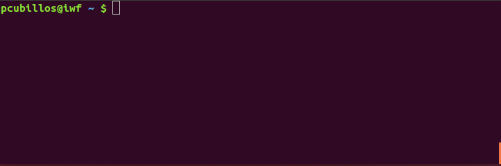

.. _pdf:

PDF Management
==============

Since version 1.2, ``bibmanager`` also doubles as a PDF database.  The
following commands describe how to fetch PDF entries from ADS, or
manually link and open the PDF files associated to the ``bibmanager``
database.  All PDF files are stored in the ``home``/pdf folder
(see :ref:`config`, for more info to set ``home``).

PDF files can also be manually linked to the database entries via the
``bibm edit`` command (see :ref:`meta`).

----------------------------------------------------------------------

fetch
-----

Fetch a PDF file from ADS.

**Usage**

.. code-block:: shell

  bibm fetch [-h] [-o] [keycode] [filename]

**Description**

This command attempts to fetch from ADS the PDF file associated to a
Bibtex entry in the ``bibmanager`` database.  The request is made to the
Journal, then the ADS server, and lastly to ArXiv until one succeeds.
The entry is specified by either the BibTex key or ADS bibcode, these
can be specified on the initial command, or will be queried after
through the prompt (see examples).

If the output PDF filename is not specified, the routine will guess a
name with this syntax: LastnameYYYY_Journal_vol_page.pdf

| Requests for entries not in the database can be made only
  by ADS bibcode (and auto-completion wont be able to predict their
  bibcode IDs).
| *(New since version 1.2)*

**Options**

|  **keycode**
|       Either a BibTex key or an ADS bibcode identifier.
|
|  **filename**
|       Name for fetched PDF file.
|
|  **-h, -\\-help**
|       Show this help message and exit
|
|  **-o, -\\-open**
|       Open the fetched PDF if the request succeeded.

**Examples**

.. note::  These examples assume that you have this entry into the database: Rubin, V. C. et al. (1980), ApJ, 238, 471.  E.g., with: ``bibm ads-add 1980ApJ...238..471R RubinEtal1980apjGalaxiesRotation``

A ``bibm fetch`` call without arguments triggers a prompt search with
auto-complete help:

   Note that as you navigate through the options, the display shows info
   about the entries at the bottom.  Also, as long as the user
   provides a valid bibcode, you can fetch any PDF (no need to be an
   entry in the database).

.. code-block:: shell
		
  # Fetch PDF for entry by BibTex key:
  bibm fetch RubinEtal1980apjGalaxiesRotation

  Fetching PDF file from Journal website:
  Request failed with status code 404: NOT FOUND
  Fetching PDF file from ADS website:
  Saved PDF to: '/home/user/.bibmanager/pdf/Rubin1980_ApJ_238_471.pdf'.

  To open the PDF file, execute:
  bibm open RubinEtal1980apjGalaxiesRotation

  # Fetch PDF fir entry by ADS bibcode:
  bibm fetch 1980ApJ...238..471R
  ...
  Fetching PDF file from ADS website:
  Saved PDF to: '/home/user/.bibmanager/pdf/Rubin1980_ApJ_238_471.pdf'.

  To open the PDF file, execute:
  bibm open RubinEtal1980apjGalaxiesRotation

  
  # Fetch and set the output filename:
  bibm fetch 1980ApJ...238..471R  Rubin1980_gals_rotation.pdf
  ...
  Fetching PDF file from ADS website:
  Saved PDF to: '/home/user/.bibmanager/pdf/Rubin1980_gals_rotation.pdf'.

  To open the PDF file, execute:
  bibm open RubinEtal1980apjGalaxiesRotation

A ``bibm fetch`` call with the ``-o/--open`` flag automatically opens
the PDF file after a successful fetch:

.. code-block:: shell

  # Use prompt to find the BibTex entry (and open the PDF right after fetching):
  bibm fetch RubinEtal1980apjGalaxiesRotation -o

  Fetching PDF file from Journal website:
  Request failed with status code 404: NOT FOUND
  Fetching PDF file from ADS website:
  Saved PDF to: '/home/user/.bibmanager/pdf/Rubin1980_ApJ_238_471.pdf'.

----------------------------------------------------------------------

open
----

Open the PDF file of a BibTex entry in the database.

**Usage**

.. code-block:: shell

  bibm open [-h] [keycode]

**Description**

This command opens the PDF file associated to a Bibtex entry in the
``bibmanager`` database.  The entry is specified by either its BibTex key,
its ADS bibcode, or its PDF filename.  These can be specified on the
initial command, or will be queried through the prompt (with
auto-complete help).

| If the user requests a PDF for an entry without a PDF file but with an
  ADS bibcode, ``bibmanager`` will ask if the user wants to fetch the PDF
  from ADS.
| *(New since version 1.2)*

**Options**

|  **keycode**
|       Either a key or an ADS bibcode identifier.
|
|  **-h, -\\-help**
|       Show this help message and exit

**Examples**

.. code-block:: shell

  # Open setting the BibTex key:
  bibm open RubinEtal1980apjGalaxiesRotation

  # Open setting the ADS bibcode:
  bibm open 1980ApJ...238..471R

  # Open setting the PDF filename:
  bibm open Rubin1980_ApJ_238_471.pdf

.. code-block:: shell

  # Use the prompt to find the BibTex entry:
  bibm open
  Syntax is:  key: KEY_VALUE
         or:  bibcode: BIBCODE_VALUE
         or:  pdf: PDF_VALUE
  (Press 'tab' for autocomplete)
  key: RubinEtal1980apjGalaxiesRotation

----------------------------------------------------------------------

pdf
---

Link a PDF file to a BibTex entry in the database.

**Usage**

.. code-block:: shell

  bibm pdf [-h] [keycode pdf] [name]

**Description**

This command manually links an existing PDF file to a Bibtex entry in
the ``bibmanager`` database.  The PDF file is moved to the *'home/pdf'*
folder (see :ref:`config`).
The entry is specified by either the BibTex key or ADS bibcode, these
can be specified on the initial command, or will be queried after
through the prompt (see examples).

| If the output PDF filename is not specified, the code will preserve
  the file name.  If the user sets *'guess'* as filename, the code will
  guess a name based on the BibTex information.
| *(New since version 1.2)*

**Options**

|  **keycode**
|       Either a key or an ADS bibcode identifier.
|
|  **pdf**
|       Path to PDF file to link to entry.
|
|  **filename**
|       New name for the linked PDF file.
|
|  **-h, -\\-help**
|       Show this help message and exit

**Examples**

Say you already have an article's PDF file here: *~/Downloads/Rubin1980.pdf*

.. code-block:: shell
  
  # Link a downloaded PDF file to an entry:
  bibm pdf 1980ApJ...238..471R ~/Downloads/Rubin1980.pdf
  Saved PDF to: '/home/user/.bibmanager/pdf/Rubin1980.pdf'.

  # Link a downloaded PDF file (guessing the name from BibTex):
  bibm pdf 1980ApJ...238..471R ~/Downloads/Rubin1980.pdf guess
  Saved PDF to: '/home/user/.bibmanager/pdf/Rubin1980_ApJ_238_471.pdf'.

  # Link a downloaded PDF file (renaming the file):
  bibm pdf 1980ApJ...238..471R ~/Downloads/Burbidge1957.pdf RubinEtal_1980.pdf
  Saved PDF to: '/home/user/.bibmanager/pdf/RubinEtal_1980.pdf'.

.. code-block:: shell

  # Use the prompt to find the BibTex entry:
  bibm pdf
  Syntax is:  key: KEY_VALUE PDF_FILE FILENAME
         or:  bibcode: BIBCODE_VALUE PDF_FILE FILENAME
  (output FILENAME is optional, set it to guess for automated naming)

  key: RubinEtal1980apjGalaxiesRotation ~/Downloads/Rubin1980.pdf
  Saved PDF to: '/home/user/.bibmanager/pdf/Rubin1980.pdf'.
